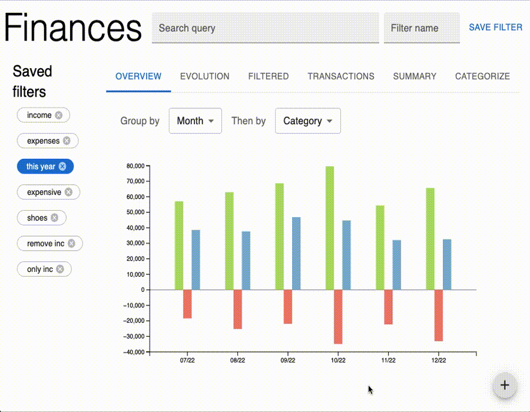

# Finances app

An unnamed app to categorize and visualize financial transactions data in OFX. Made with React + d3.



## Install

Clone this repo and run:

```sh
nvm use 16
npm i
npm start
```

Fake data and example filters will be added the first time you open the app so you can play around.

## Load transactions

- Press the + button on the bottom right
- Select as many OFX files as you'd like
- Choose if you want to erase previously loaded data and click load

## Visualize and categorize transactions

- Overview tab shows a bar chart of the transactions amount grouped by some attribute. Hovering each bar shows a subgrouping.
- Evolution tab shows more or less the same data as Overview, but in a line chart. It is more appropriate to compare spendings in different categories.
- The Filtered tab shows transactions that remain after applying all active (blue) filters, so you can view which transactions are being plotted on the graphs.
- The Transactions tab shows all transactions without any filters applied, so you can visualize your current search only.
- Summary shows a bunch of stats about the transactions.
- Categorize helps you set the category of your transactions efficiently. It shows your transactions grouped by description and sorted by amount, so you can tag whatever makes more difference in the visualization first.

## Thanks

Thanks to my friends and girlfriend <3 that helped me iterate the design. :)
